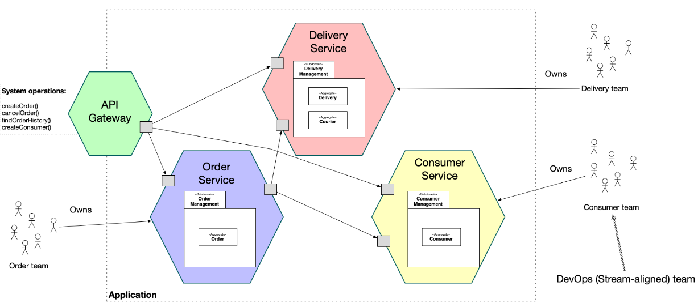
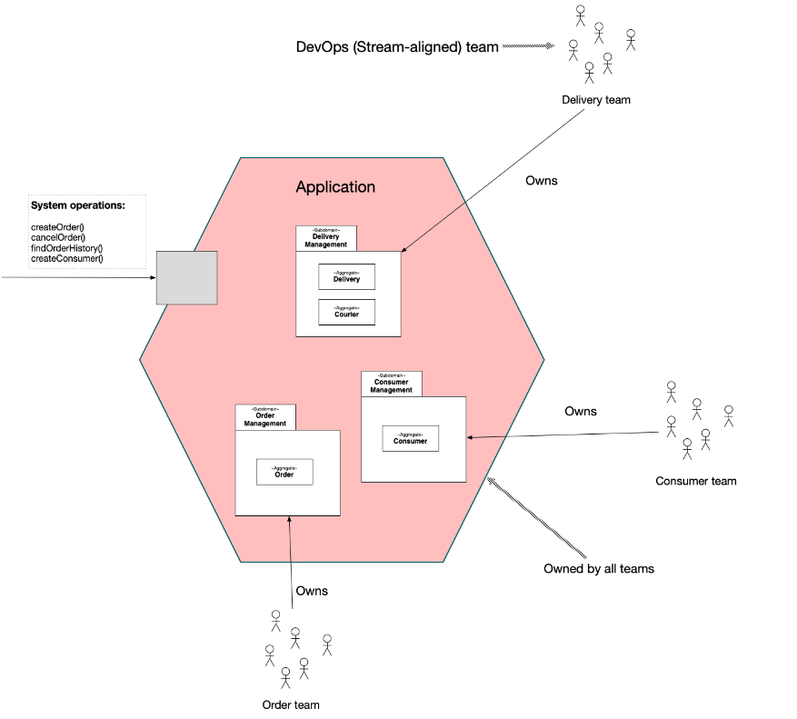

# E24-OLA1-System-Integration
Research Task by Jamie, Helena & Isak

### Watch the Video Summary: 
[](https://www.youtube.com/watch?v=QjGu_uiMG4g)


# Table of Contents

- [Introduction](#introduction)

- [Technology Stack](#technology-stack)

- [What is Enterprise Integration?](#what-is-enterprise-integration)

- [Architectural Styles](#architectural-styles)
   - [Monolithic Architecture](#monolithic-architecture)
   - [Microservices Architecture](#microservices-architecture)

- [Integration Patterns](#integration-patterns)
   - [Pipes and Filters](#pipes-and-filters)
   - [Message Broker](#message-broker)
   - [Other Patterns](#other-patterns)

- [Diagrams](#diagrams)
   - [Diagram Microservices Architecture](#diagram-microservices-architecture)
   - [Diagram Monolith Architecture](#diagram-monolithic-architecture)
  

- [Conclusion](#conclusion)


---

## Introduction

## Technology Stack
This section outlines the tools and technologies used throughout the project for research, documentation, development, and collaboration.
- **Git**: Used for version control to track changes, manage contributions, and maintain the history of the project.
- **GitHub**: The platform for hosting the repository, managing issues, and collaborating with team members.
- **Visual Studio Code**: The primary text editor used for writing the report in Markdown, embedding diagrams, and formatting code snippets.
- **Markdown**: Chosen for writing the report due to its simplicity, readability, and compatibility with version control systems.
- **Messenger/Discord**: Used for team communication, coordinating research efforts, and sharing resources.
- **Google Scholar, YouTube, Medium**: Sources for gathering current information on Enterprise Integration and related topics.
- **IPhone 11 Pro Max Camera, Cap Cut for Editing**: Used to record the 5-minute video presentation summarizing the key findings from the report.
- **Google Slides**: For creating slides and visual aids to enhance the presentation.

## What is Enterprise Integration?
#### Data-centric integration
- **Data-centric integration is fundamentally about ensuring data consistency and accuracy**, it tends to be more naturally aligned with monolithic architectures because of their inherent centralized control over data.
#### Event Driven Integration
- **Promotes Loose couplings between components**, allowing them to operate independently and gives options for scalability.  Making it suitable for Micro Services.
#### Application-centric Integration
- **Particularly relevant in modern software development**, where building applications as a set of loosely coupled and independently deployable **components** is essential for scalability, maintainability and agility. It aligns well with **contemporary microservices (breaking larger problems into smaller chunks/services** architecture and API-driven development practices.

#### Summary
- **Data-centric integration** focuses on a single source of truth, ensuring data consistency and accuracy, ideal for scenarios requiring reliable data for decision making.

- **Event-driven integration** excels in environments needing real-time responsiveness and scalability, perfect for dynamic, fast-changing conditions.

- **Application-centric integration** emphasizes modularity and reusability, suited for scalable, maintainable applications, often aligning with microservices architecture and API-driven development.

## Architectural Styles
### Monolithic Architecture
In a monolithic architecture, the entire application is built as a single unit, typically comprising three main components: the user interface, server-side processing, and the database. This approach has several advantages, such as simplicity, ease of development, and deployment. However, it also poses challenges in terms of scalability, maintainability, and flexibility.

Some of the cons of using a monolithic architecture include:
- **Scaling:** In monolithic applications it can be hard to scale individual parts of the application, as the entire application needs to be scaled together.
- **Maintainability:** As the application grows, it can become increasingly difficult to maintain and update the codebase, leading to longer development cycles and increased risk of errors.
- **Flexibility:** Monolithic applications are typically built using a single technology stack, which can limit the ability to adopt new technologies or frameworks.

Despite these challenges, monolithic architectures are still relevant in certain scenarios, such as:
- **Small to medium-sized applications:** For smaller applications with limited complexity, a monolithic architecture can be a simple and cost-effective solution.
- **Legacy systems:** Many existing applications are built using a monolithic architecture, and migrating to a microservices architecture can be a complex and time-consuming process.
- **Rapid prototyping:** When building a prototype or minimum viable product (MVP), a monolithic architecture can be a quick way to get a working application up and running.

Monolithic architecture are used in industries such as:
- **Reddit:** Reddit is built using a monolithic architecture, with a single codebase that handles all aspects of the application, from user authentication to content delivery. As it grew, Reddit shifted towards a microservices architecture to improve scalability and performance.
- **eBay:** eBay started as a monolithic application, but has since transitioned to a microservices architecture to improve scalability, flexibility, and maintainability.
- **GitLab:** GitLab is built using a monolithic architecture, with a single codebase that handles all aspects of the application, from source code management to continuous integration. GitLab has explored a microservices architecture for certain components to improve scalability and performance.


### Microservices Architecture
In a microservices architecture, an application is broken down into a set of small, independent services that communicate with each other through APIs. Each service is responsible for a specific function or feature, and can be developed, deployed, and scaled independently of the other services. 

Some of the cons of using a microservices architecture include:
- **Complexity:** Microservices architectures can be more complex to design, develop, and maintain than monolithic architectures, as they involve managing multiple services and communication between them.
- **Overhead:** There is additional overhead involved in managing multiple services, such as service discovery, load balancing, and fault tolerance, which can add complexity to the system.
- **Data consistency:** Ensuring data consistency across multiple services can be challenging, as each service has its own database and may need to communicate with other services to maintain consistency.
- **Testing:** Testing a microservices architecture can be more complex than testing a monolithic architecture, as it involves testing the interactions between multiple services.

Despite these challenges, microservices architectures offer several advantages over monolithic systems, such as:
- **Scalability:** Microservices architectures are highly scalable, as individual services can be scaled independently of each other, allowing for better resource utilization and improved performance.
- **Flexibility:** Microservices architectures are more flexible than monolithic systems, as they allow for the use of different technologies, frameworks, and programming languages for each service.
- **Resilience:** Microservices architectures are more resilient to failures than monolithic systems, as failures in one service do not necessarily affect the entire application.
- **Agility:** Microservices architectures enable teams to work independently on different services, allowing for faster development cycles and more frequent updates.

Microservices architectures are heavily used in industries such as:
- **E-commerce:** Companies like Amazon and eBay use microservices architectures to build scalable, high-performance e-commerce platforms that can handle millions of transactions per day.
- **Social media:** Platforms like Facebook and Twitter use microservices architectures to build complex, real-time applications that can handle large volumes of user data and interactions.
- **Netflix:** Netflix uses a microservices architecture to build its streaming platform, allowing it to deliver personalized content to millions of users around the world.

**To put them together:**
The monolithic architecture works good as a combined unit, where all the functionality is integrated in one application. It is easy to develop and deploy, but the microservice is a more distributed architecture where the application is broken down into smaller, independent services.

## Integration Patterns
### Pipes and Filters


The pipes and filters pattern is a design pattern that allows you to process data in a series of steps, where each step is a filter that transforms the data in some way. The filters are connected by pipes, which are used to pass data from one filter to the next. This pattern is commonly used in scenarios where you need to process data in a modular and extensible way, such as in data processing pipelines or data transformation workflows.

```
  A[Input] --> B(Filter1)
  B --> C(Filter2)
  C --> D(Filter3)
  D --> E[Output]
```

This diagram shows a simple example of the pipes and filters pattern, where data flows from an input source (A) through a series of filters (B, C, D) to an output destination (E).

**Use Cases**:

Image Processing Pipelines
- Scenario: Editing images by applying multiple transformations in a sequence.

Example:
- Resize Filter: Resizes the image to the desired dimensions.
- Sharpen Filter: Enhances the sharpness of the image.
- Color Correction Filter: Adjusts color balance and brightness.
- Compression Filter: Compresses the image for storage or transmission.
- Output: The final processed image.

Why Pipes and Filters? Each transformation can be implemented as a separate filter, allowing flexibility in the order of transformations and enabling new filters to be added easily. Furthermore, the modular nature of this pattern makes it easy to test and maintain individual filters, or undo specific transformations if needed.

Real-Time Log Processing
- Scenario: Analyzing server logs in real-time to detect security threats or performance issues.

Example:
- Log Ingestion Filter: Collects logs from multiple servers.
- Pattern Matching Filter: Looks for suspicious activity or specific error patterns.
- Alert Generation Filter: Generates alerts if any suspicious activity is detected.
- Storage Filter: Stores the filtered logs in a database for further analysis.

Why Pipes and Filters? Each step (collect, match, alert, store) is independent, making it easy to modify or expand the pipeline as new log patterns or analytics needs emerge.
  
### Message Broker

The Message Broker pattern is a messaging pattern that involves the use of a message broker to facilitate communication between different components of a system. In this pattern, components communicate by sending messages to a central message broker, which then routes the messages to the appropriate recipients. This decouples the sender and receiver, allowing them to communicate asynchronously without being directly connected.

```
  A(Sender) --> Message Broker --> B(Receiver)
```

The diagram shows how the sender (A) sends a message to the message broker, which then routes the message to the receiver (B).

**Use Cases**:

Microservices Communication
- Scenario: In a microservices architecture, different services need to communicate with each other to coordinate tasks.

Example: A user registration service sends a message to notify other services (email, analytics) after a user registers.

Why Use a Message Broker: Microservices are decoupled, allowing independent scaling, error isolation, and asynchronous communication. The broker routes messages from the registration service to the email and analytics services without them needing to know about each other.

### Other Patterns
**Publish-Subscribe**
- In the Publish-Subscribe pattern, a producer (publisher) sends messages to multiple consumers (subscribers) through a messaging system. Instead of sending messages directly to specific consumers, the messages are sent to a topic or channel. Subscribers can register their interest in certain types of messages, and the messaging system delivers messages only to those who are subscribed.

Use Cases:
- Real-time notifications (e.g., stock price updates, news alerts).
- Event-driven systems where multiple services need to react to the same event (e.g., user signup triggering notifications, analytics, and logging).

**Request-Reply**
- In the Request-Reply pattern, a client (requester) sends a request to a service (replier), and the service processes the request and sends back a response. This is a synchronous communication pattern, often used when the requester expects a result or acknowledgment.

Use Cases:
- Web services where a client sends a request to retrieve data (e.g., API calls to retrieve user info, payment verification).
- Database queries where a request for data is followed by an immediate reply containing the result.

## Diagrams

### Diagram Microservices Architecture

<a href="https://microservices.io/patterns/microservices.html" 
           target="_blank">Source
</a> 

Diagram Explanation
API Gateway:
- Acts as the entry point for all client requests, routing them to the appropriate microservices. It handles cross-cutting concerns such as authentication, load balancing, and request routing.

Microservices:
- Delivery Service: Handles the delivery and which courier the delivery is the delivered through.
- Order Service: Handles the creation and management of orders. 
- Customer Service: Manages customer profiles and information. 


### Diagram Monolithic Architecture

<a href="https://microservices.io/patterns/monolithic.html" 
           target="_blank">Source
</a> 

In a monolithic architecture the application is a single deployable component and all operations are handled within that single component. 

## Conclusion

The shift from monolithic to microservices architecture represents a critical evolution in enterprise integration, aimed at addressing the increasing demands for scalability, maintainability, and resilience. Monolithic architectures, while simpler to develop and deploy initially, tend to encounter challenges in terms of scaling, flexibility, and resource management as applications grow. Conversely, microservices allow for more granular control, where independent services can be developed, deployed, and scaled separately. This makes them highly suited for modern, agile development environments.

Reddit and eBay serve as prime examples of organizations that have transitioned from monolithic systems to microservices. In Reddit's case, adopting microservices allowed for better system scalability and maintainability, addressing issues tied to rapid user growth. eBay faced similar challenges and utilized the **strangler pattern** to gradually migrate its monolithic application to a microservices architecture without disrupting its ongoing operations [1] [2].

While the advantages of microservices—such as improved fault isolation, development agility, and resource optimization—are substantial, the transition is not without its challenges. Organizations must navigate complexities in data management, service communication, and operational overhead. However, with strategies like **incremental refactoring** and **domain-driven design**, the risks can be mitigated, ensuring a smooth migration.

Ultimately, enterprise integration strategies—whether through monolithic or microservices architectures—must align with the unique requirements of the business. By understanding the strengths and limitations of both approaches, organizations can make informed decisions that enhance their scalability, flexibility, and overall system performance.

---

[1]: https://blog.bytebytego.com/p/reddits-architecture-the-evolutionary
[2]: https://ecommerce.cloudflight.io/blog/10-companies-that-implemented-the-microservice-architecture-and-paved-the-way-for-others


